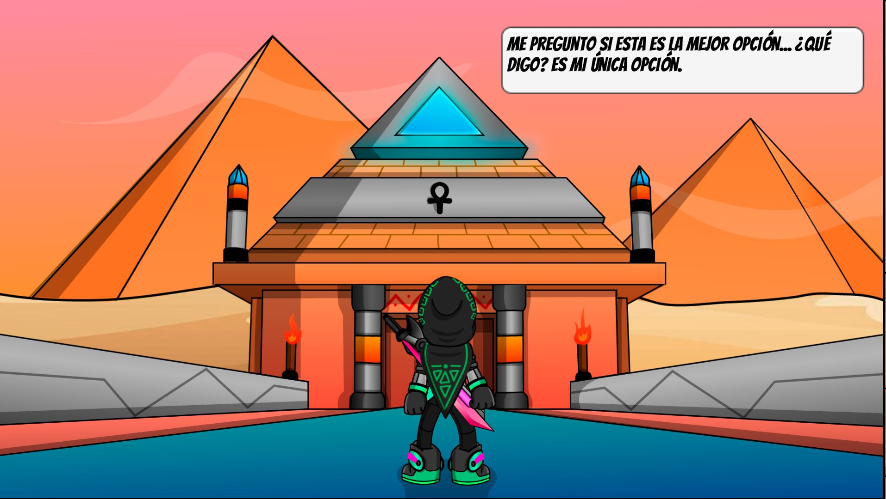
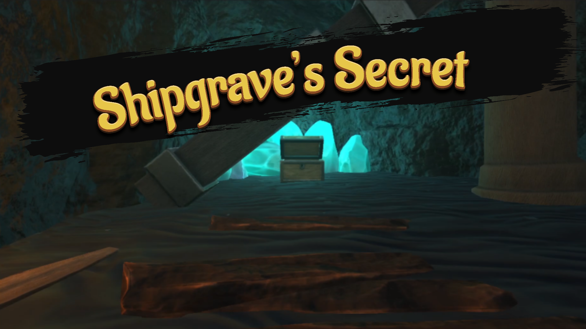

<!DOCTYPE html>
<html>
<head>
    <title>Gerard Galicia Portfolio</title>
    <link rel="preconnect" href="https://fonts.googleapis.com">
    <link rel="preconnect" href="https://fonts.gstatic.com" crossorigin>
    <link href="https://fonts.googleapis.com/css2?family=Montserrat&family=Roboto:wght@300&display=swap" rel="stylesheet">

    <link rel = "stylesheet" href ="style.css"/>
</head>
<body>
    

    <!-- class = identificar mas de un elemento para seleccionar con CSS o javascript-->

    <header id="titulo">
       
        <nav>
            
            Gerard Galicia
            <ul class ="nav_links">    
                <li><a href ="#Sobremi">Sobre mi</a></li>
                <li><a href ="#Habilidades">Habilidades</a></li>
                <li><a href ="#Portfolio">Portfolio</a></li>
                <li><a href ="#Proyectos">Proyectos</a></li>
                <li><a href ="https://gerardg.artstation.com/">Artstation</a></li>
            </ul>
            <a href="mailto:ggaliciabcn@gmail.com" class ="cta" href="#"><button>Contact</button></a>
        </nav>
        <section class ="Inicio">
         <h1> Gerard Galicia</h1>
         <h3>Programador / Artista 3D</h3>
        </section>
    </header>
     
    
    <section class = "container">
        

        <section id="Sobremi" class="post">
            <h2 class ="subtitulos">Sobre mi</h2>
            

            
Hola! Soy Gerard Galicia, un apasionado del desarrollo de videojuegos tanto de la programación como el arte 3D.
                Soy una persona trabajadora, responsable, organizada y sociable, con ganas de aprender y trabajar en el sector.
                Me gusta cooperar con el equipo y motivarlos para obtener el mejor resultado.
            

            

                En todos mis proyectos he trabajado con el motor de juegos Unity, estoy interesado en las nuevas tecnologías que surgen a lo largo de los años,
                estoy muy interesado en la realidad virtual y la realidad aumentada porque es una nueva forma de jugar a los videojuegos diferente a lo habitual.
            

        </section>
        

        <section class="post">
            
<h2 id="Habilidades" class="subtitulos">Habilidades</h2>

            <table style="width: 1000px;">
                <thead>
                 <tr>
                     <th><h3 class ="TitulosHabilidades">Programación</h3></th>
                     <th><h3 class ="TitulosHabilidades">Arte 3D</h3></th>
                     <th><h3 class = "TitulosHabilidades">Motor de juegos</h3></th>
                 </tr>
                </thead>
                <tbody>
                 <tr>
                     <td>C#</td>
                     <td>3Ds Max</td>
                     <td>Unity</td>
                 </tr>
                 <tr>
                     <td>Lua</td>
                     <td>Blender</td>
                     <td>Defold</td>
                 </tr>
                 <tr>
                     <td>R</td>
                     <td>ZBrush</td>
                 </tr>
                 <tr>
                    <td>Java</td>
                    <td>Substance 3D Painter</td>
                </tr>
                <tr>
                    <td>HTML</td>
                    <td>Mudbox</td>
                </tr>
                <tr>
                    <td> CSS</td>
                    <td></td>
                </tr>
                </tbody>
             </table>
       

        <section class ="post">
            
<h2 id ="Portfolio" class = "subtitulos">PORTFOLIO</h2>

            <h3 class ="EmpathyCode">Empathy Code</h3>
            
            Videojuego de plataformas 2D - Rol de diseñador y artista 2D
            <a href="https://lrikuz.itch.io/empathy-code" class ="cta" href="#"><button>Detalles</button></a>

            <h3 class ="Shipgrave">Shipgrave's Secret</h3>
            
            Videojuego 3D FPS de sigilo - Rol de artista 3D
             
            <a href="https://joel-gallarte.itch.io/shipgraves-secret" class ="cta" href="#"><button>Detalles</button></a>
            
        </section>

                 
        

        <section class ="Proyectos">
            <h2 class ="subtitulos">Proyectos</h2>

            <iframe width="490" height="275" src="https://www.youtube.com/embed/wINYi5-DVKU" frameborder="0" allowfullscreen></iframe>
            <iframe width="490" height="275" src="https://www.youtube.com/embed/q38wUWwhQBM" frameborder="0" allowfullscreen></iframe>
            <iframe width="490" height="275" src="https://www.youtube.com/embed/aR8hhRpiytk" frameborder="0" allowfullscreen></iframe>
            <iframe width="490" height="275" src="https://www.youtube.com/embed/VYyEIlETznE" frameborder="0" allowfullscreen></iframe>
            
        </section>

        </section>

    </section>

    <footer>
        <section>
        <a id="comienzo" href="#titulo">Ir al comienzo</a>
        </section>
        
        
Copyright 2023

    </footer>
    
</body>
</html>
